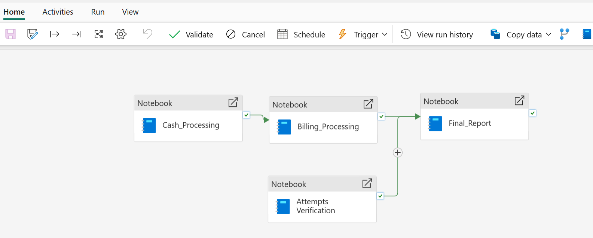
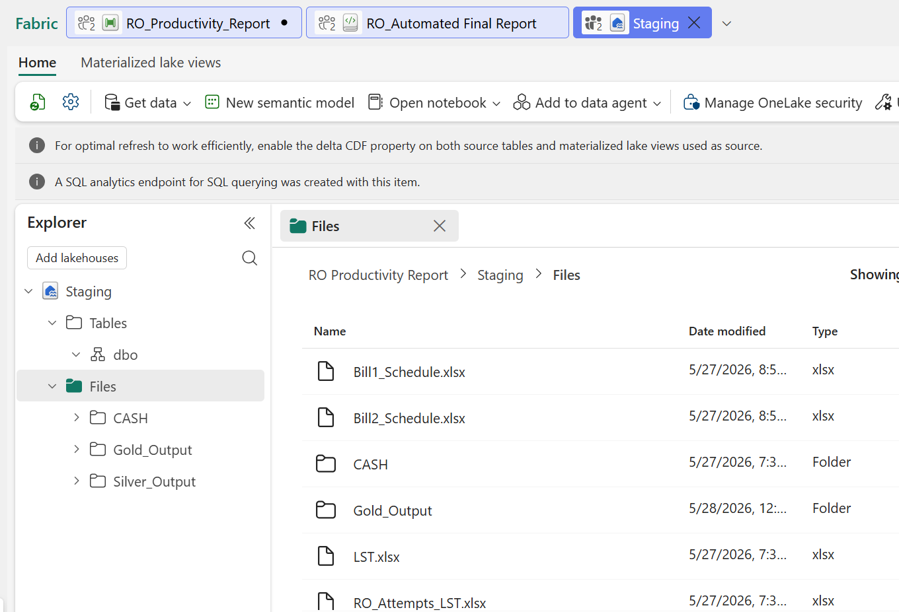
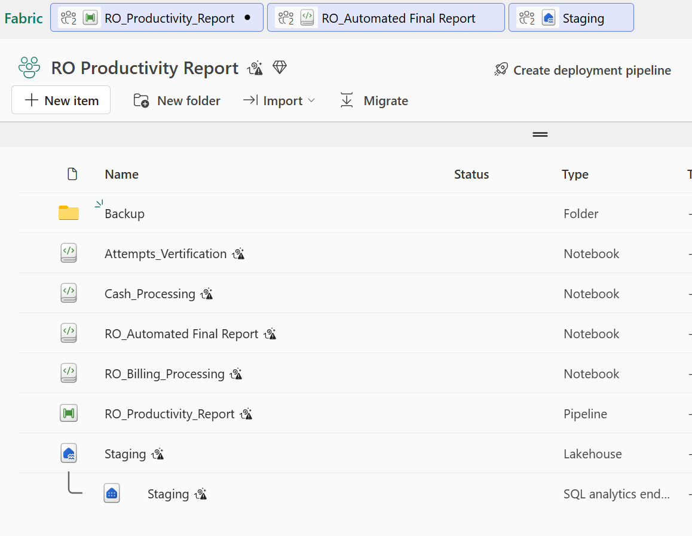
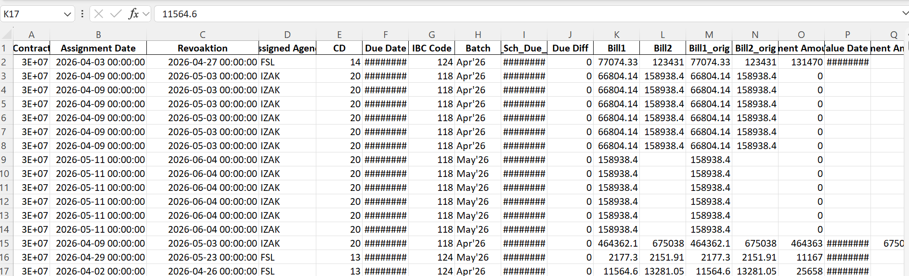
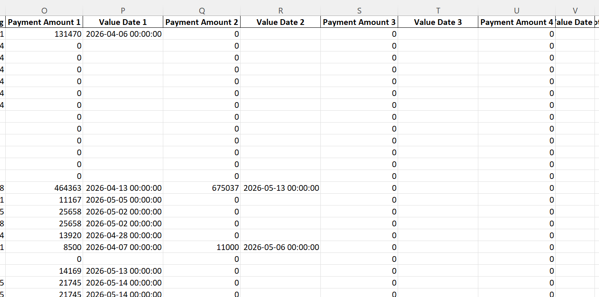
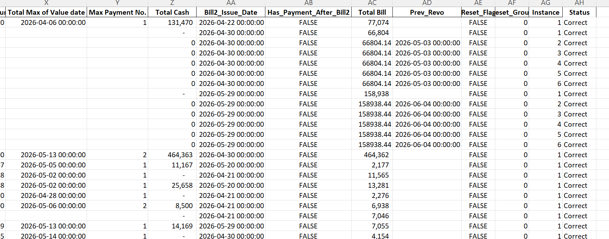

# 🔌 Recovery Productivity Report (Microsoft Fabric)

## 📌 Overview
This project demonstrates an end-to-end data pipeline built using Microsoft Fabric to analyze recovery productivity and performance.

The solution integrates multiple datasets including:
- Cash Tagging Data
- Billing Data
- Recovery Attempts Data

## 🎯 Objective
To evaluate recovery productivity by combining financial and operational data to generate actionable insights and performance reports.

## 🧱 Architecture
The pipeline is designed using a layered Lakehouse architecture:

- **Staging Layer** → Raw Excel data ingestion (CASH, Billing, Attempts)
- **Processing Layer (Silver)** → Data cleaning, transformation, merging
- **Output Layer (Gold)** → Final reports and summaries in Excel/CSV format

## ⚙️ Tools & Technologies
- Microsoft Fabric (Lakehouse & Notebooks)
- Python (Pandas, PySpark)
- Data Transformation & Analysis

## 📂 Project Structure
## 🔄 Workflow
1. Ingest raw data into Lakehouse (Files)
2. Process data using Fabric Notebooks
3. Perform joins, aggregations, and transformations
4. Generate final reports
5. Save outputs to Lakehouse Output folder

## 📊 Key Features
- Multi-source data integration
- Automated report generation
- Dynamic Excel outputs
- Recovery performance tracking
- Structured data pipeline (Bronze → Silver → Output)

## 🚫 Data Disclaimer
⚠️ Data files are not included in this repository due to confidentiality.

## ▶️ How to Run
1. Upload your own datasets to Microsoft Fabric Lakehouse:
   - Files/CASH
   - Files/Billing Data
   - Files/Attempts Data
   - Files/Billing Schedule

2. Open notebooks in Fabric
3. Run them sequentially in pipeline order

## 📸 Screenshots

      ## 🔄 Pipeline Orchestration

      ## 🔄 Lakehouse

      ## 🔄 Workspace

      ## 🔄 Output File

      

## 👤 Author
**Abdul Moeed Khan**  
